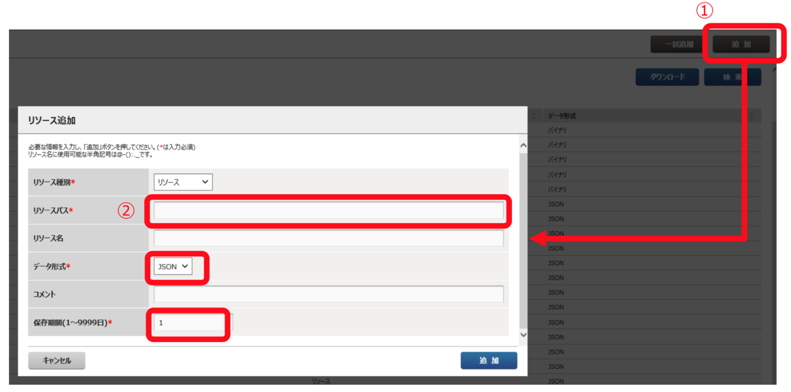
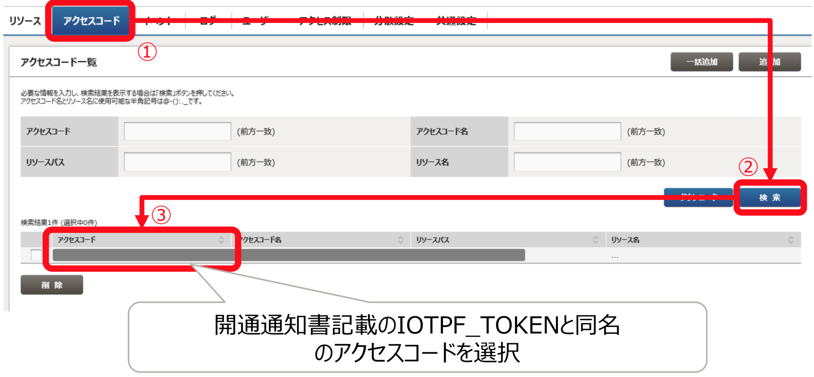
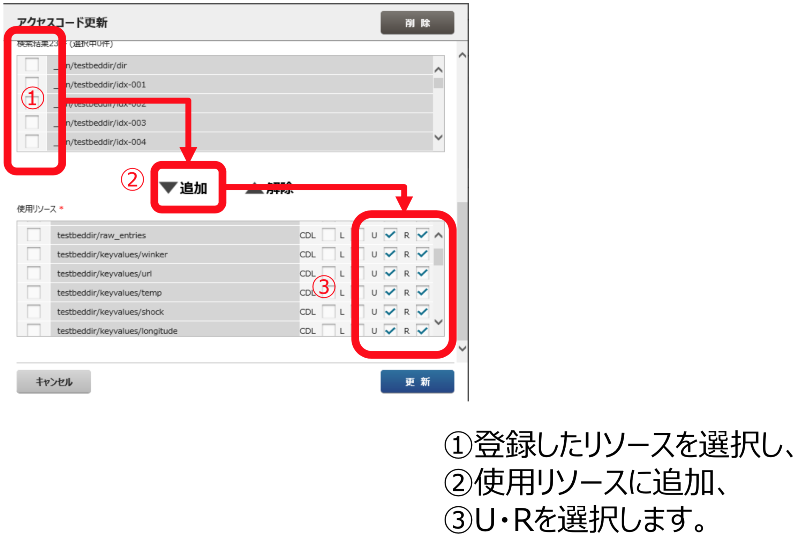
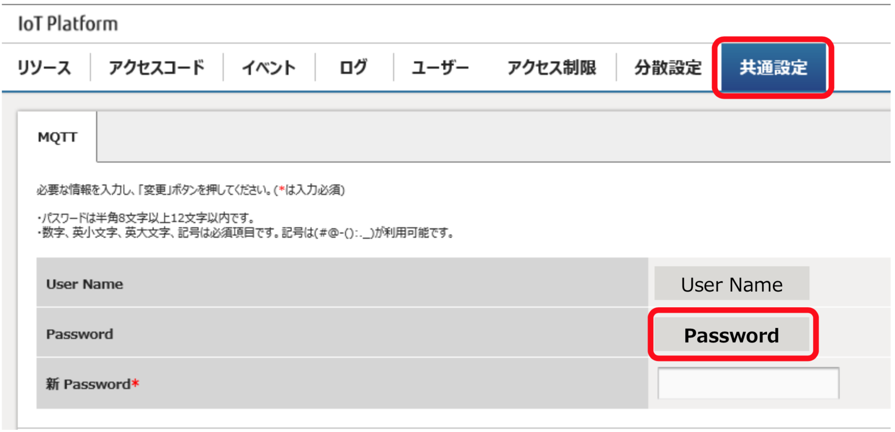
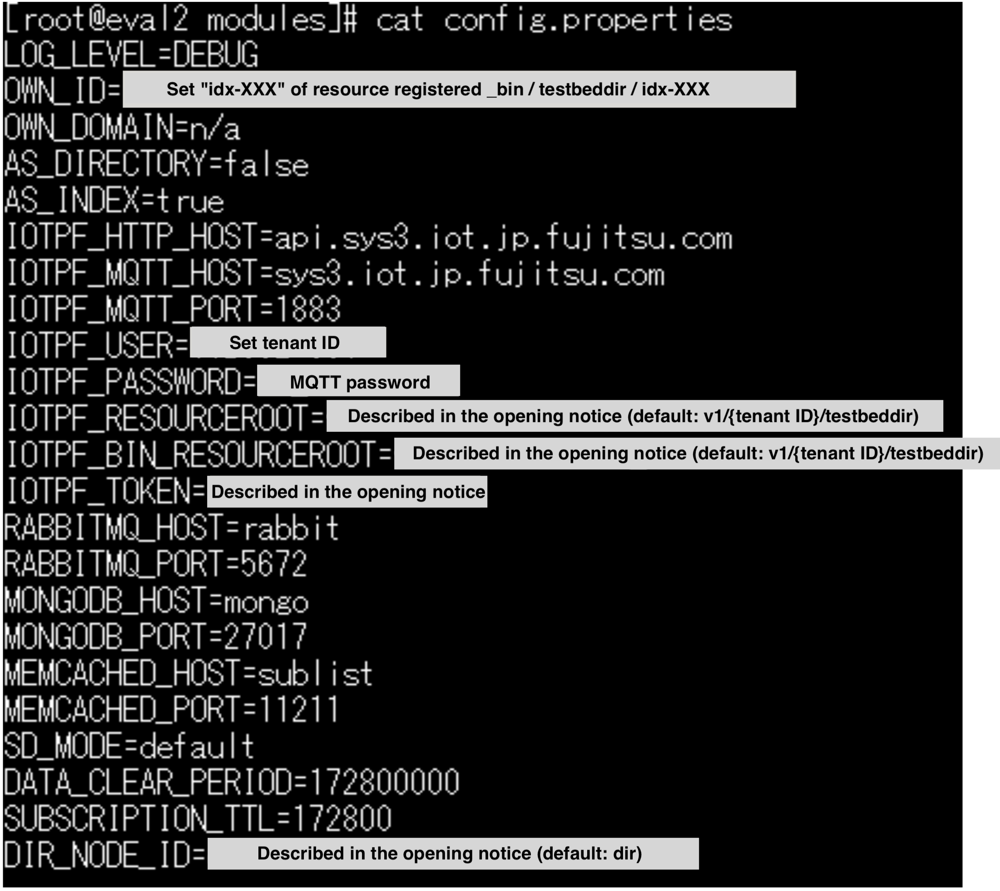

# DRC-DA IoT Platform Setup Procedure

## Contents to be Set for Customers

* For deployment of index node, sink-agent, IoT Platform requires pre-setting.
* This document explains how to set up the IoT Platform required for the IoT test-bed.
* When adding a new index node and sink-agent, prepare the following resources in advance and tie it to the access code with the same name as **IOTPF\_TOKEN** described in the opening notice form.

| Data Format    | Resource Path            | Notes |
|----------------|--------------------------|-------|
| JSON           | testbeddir/keyvalues/**XXX** | Attribute information (**\***) (**XXX** is arbitrary attribute information) |
| Binary (\_bin) | \_bin/testbeddir/idx-0**XX** | Index information (**XX**: numerical value) |

\* **XXX** of **/keyvalues/XXX** contains the attribute name to be searched.

```
Ex. when retrieving vehicle information:

* testbeddir/keyvalues/door
* testbeddir/keyvalues/kmh
* testbeddir/keyvalues/temp
* testbeddir/keyvalues/shock
* testbeddir/keyvalues/latitude
* testbeddir/keyvalues/longitude
* testbeddir/keyvalues/location
```


## Setting Screen (Resource Path, Access Code)

**Resource Creation**

Select "Add (追加)" from "resource (リソース)" of the service portal



* リソースパス = Resource Path
* データ形式 = Data format (**JSON**/**binary** (**\_bin**))
* 保存期間を設定します = Set the retention period. (Refer to the previous section for setting contents) Notes that the retention period is arbitrary assigned.


**Access Code Setting**



1\. Select "Search (検索)" from "Access Code (アクセスコード)" of Service Portal (Normally, it is not necessary to add newly.)

2\. Select an access code with the same name as **IOTPF_TOKEN** described in the opening notice. (開通通知書記載のIOTPF_TOKENと同名 のアクセスコードを選択)



1\. Select the registered resource (登録したリソースを選択し)

2\. Add to used resources (使用リソースに追加)

3\. Select U · R (U・Rを選択します)


## MQTT Password Confirmation

* By selecting "Common Setting (共通設定)" from the dashboard, you can check the currently set MQTT password.

* When building **index nodes** and **sink-agent**, please note that it is necessary for modify the **config.properties** file.




Although you can change the MQTT password, **please do not change the MQTT password**. If you wish to change, you also need to change the setting of the directory node operated by Fujitsu. In that case please be sure to contact the test-bed ML.


## DRC-DA config.properties Settings

For details of the setting procedure, please refer to a separate sheet (**setting_procedure.pdf**)




## References

###【Pre-set items】

* At the point where the opening notice documentation was sent, the following resources are set in advance.
* In addition, these resources are linked to the access code with the same name as "IOTPF_TOKEN" described in the opening notice document.
* This information is necessary for using DRC-DA. Please be careful not to cancel linking from access code or delete the resource.

```
Data Format    | Resource Path            
---------------|--------------------------
JSON           | testbeddir/gws
               | testbeddir/raw_entries
               | testbeddir/keyvalues/test
               | testbeddir/keyvalues
               | testbeddir/subscriptions
---------------|--------------------------               
Binary (_bin)  | _bin/testbeddir/dir
               | _bin/testbeddir/idx-999
```


## Copyright

COPYRIGHT Fujitsu Limited 2017 and FUJITSU LABORATORIES LTD. 2017
