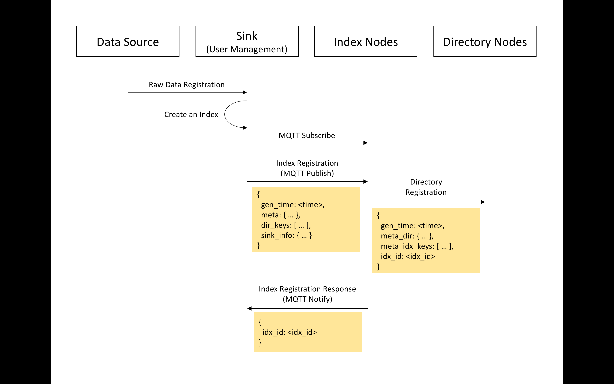
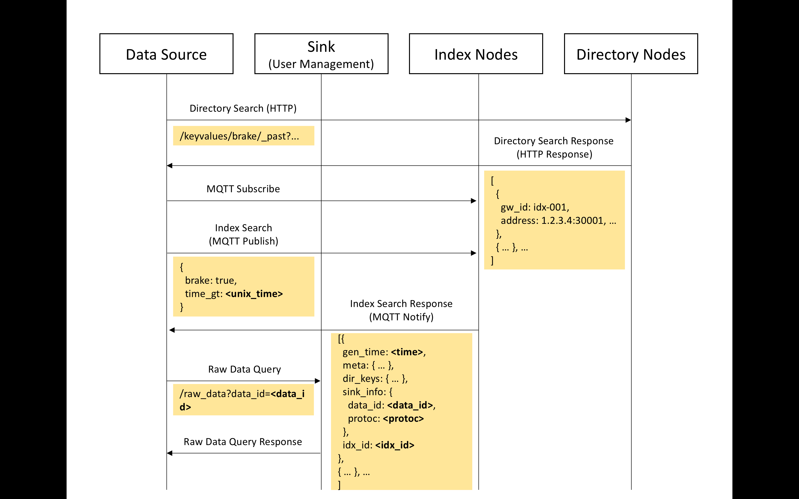
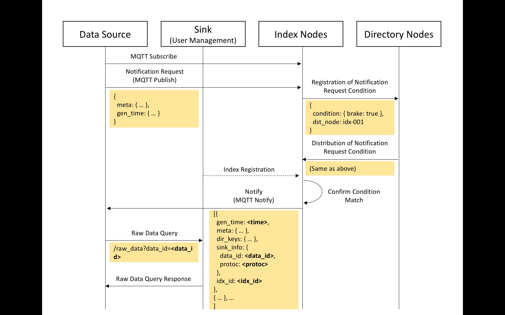

# DRC-DA README

## API List

###Directory Node
 
The directory node has a web API by IoT-PF For details, refer to the API reference manual of [IoT-PF](https://iot-docs.jp-east-1.paas.cloud.global.fujitsu.com/en/manual /v3/apireference.pdf) for more information.

In response to IoT-PF, there are fields **\_resource\_path** and **\_date** besides the **\_data** field which is the response content itself, but there is no meaning when using IoT-DA. In the following, only the **\_data** field is described.

Note that blanks and single quotes in URIs require URL encoding.

**Key Information Acquisition**

Search with meta information of the data you want to acquire, and obtain gw_id of the index node having the corresponding data.

* Request destination URI & method:

`GET /keyvalues/<key>/_past?$Filter=value eq '<value>'&$filter=gen_time gt '<unixtime>'`

```json
# Reply:
[
  {
     "gw_id": <gw_id>,
     "idx_id": <idx_id>,
     "gen_time": <time>,
  },
  {...}, ...
]
```

**Gateway Information Acquisition**

Specify **gw\_id** obtained by key information acquisition and acquire detailed information of the index node.
**gw\_ip\_and\_port** obtained by this API becomes the end point for accessing the index node.

* Request destination U RI & method (all gateway information):

`GET /gws/_past`

```json
# Reply:
[
  {
    "id": <gw_id>,
    "address": <gw_ip_and_port>,
    "status": <status>,
    "location": <location>
  }, ...
]

* Since status and location are not implemented yet, null is entered.
```

* Request destination URI & method (individual gateway information)

`GET /gws/_past?$filter=id eq '<gw_id>'`

```json
# Reply:
{
  "id": <gw_id>,
  "address": <gw_ip_and_port>,
  "status": <status>,
  "location": <location>
}
```

### Index node

The index node has an asynchronous (MQTT) interface by RabbitMQ.

**Index Creation**

* Sending Topic

`drc-da/input/index-key/<response_queue_id>`

For **response\_queue\_id**, an identifier generated by UUIDv4 is used, and this ID is used as a response receiving topic to be described later.


* Payload

The format of the **sink\_info** field is indeterminate and will be specified when IoT-DA up to the raw data management in the future.

```json
{
  "gen_time": <time>,
  "meta": { #required
    <key_name>: <value>, ...
  },
  "dir_keys": [
    <key_name>,
    <key_name>, ...
  ],
  "sink_info":
  { #how to access the sink
    "name": <name>,
    "sink_address": <sink_address>,
    "protocol": <protocol>,
    "content_path": <content_path>
  }
}
```

* Response Reception Topic

`drc-da/response/<response_queue_id>`

* Response Contents

```
<TBD>
```

**Search Index**

* Sending Topic

`drc-da/output/index-key/<response_queue_id>`

* Payload

The description method of the query basically follows the MongoDB query description method.

```json
{
  "meta":{
    <search_key>: <search_value>,
    <search_key>: {
      "$gte": <value>,
      "$lte": <value>
    }
  },
  "gen_time": {
    "$gte": <unix time>,
    "$lte": <unix time>
  },
  # if want to get the certain index entry
  "idx_id": <idx_id>
}
```

**Index Notification**

* Sending Topic

`drc-da/output/set-subscription/<response_queue_id>`

* Payload

It is isomorphic to index search, however, by continuing to subscribe to the topic for responding, it is possible to immediately receive the registered index.

## Getting Started

### Premise

In order to operate the DRC-DA, IoT-PF is required as a component, and informs the person in charge in advance to inquire the resources used by default by the DRC-DA and the meta that may be registered in the **keyvalues/** It creates a resource of information key and issues an access code (one having read/write right in the configuration of DRC-DA, one having read right to **keyvalues/\*** for the user) In addition, the user receives an access code from the person in charge.

### Preparation

**Download scripts/iotda\_client\_mqtt\.rb**

In addition, build ruby (v2.1 or later) execution environment and install gem for **scripts/iotda\_client\_mqtt\.rb**.

```shell
$ gem install mqtt
$ gem install json
```

It is also possible to use a direct MQTT client, in which case **scripts/iotda\_client\_mqtt\.rb** is helpful.

### Register Index Information



It is assumed that the registrant knows the end point of the DRC-DA index node beforehand.

1\. Required libraries of **iotda\_client\_mqtt.rb**

```ruby
require '../scripts/iotda_client_mqtt'
require 'optparse'
require 'json
```

2\. Client initialization

```ruby
params = ARGV.getopts('', 'host:', 'port:')
client = IoTDAClient.new(host: params["host"], port: params["port"])
```

3\. Generate response queue identifier and subscribe to response queue

```ruby
queue_name = SecureRandom.uuid.to_s
client.subscribe_queue(queue_name: queue_name)
sleep(5)
```

`sleep(5)` is done to avoid sending response messages from the DRC-DA while the response queue is not ready.

4\. Preparation of index information

```ruby
device_id = "dev-01"
gen_time = Time.now.to_i
dir_keys = ["location", "device_id"]
meta = {
  :location => "loc-A",
  :device_id => device_id,
  :temp => 25.5,
  :humid => 60
}
sink_info = {
  :address => "192.168.0.1:8080",
  :protocol => "http"
}
```

Prepare the index information according to the regulations of the API.

5\. Transmission of index information and waiting for response

```ruby
client.publish_idx_v2( sink_info: sink_info,
                       dir_keys: dir_keys,
                       meta: meta,
                       gen_time: gen_time,
                       queue_name: queue_name )
sleep(5)
```

The sample script following the above procedure is in **tests/pub\_idx\_v2\.rb**.

### Obtaining Directory Information



We assume that IoT-PF endpoint and access code are known.

1\. Prepare key value for search

Suppose we want to search for `{"location": "loc-A"}`
In addition, suppose that the creation date and time is after `2017/07/04 15:13:31 +0900`. When converting to the UNIX time, it becomes `1499148815`.

2\. Acquire index node list with key value for search

* Request:

`curl -X GET 'http://<IoT-PF エンドポイント>/keyvalues/location? filter%20%27value%27%20eq%20%27loc-A%27&%27gen_time%27%20gt%201499148815'`

* Response:

```json
[
  {
    "gw_id": "idx-001",
    "idx_id": <uuid>,
    "gen_time": 1499148900
  }
]
```

3\. Acquire detailed information of the index node included in the response

* Request:

`curl -X GET -H 'Authorization: Bearer <token>' 'http://<IoT-PF エン ドポイント>/gws?filter%20%27id%27%20eq%20%27idx-001'`

* Response:

```json
{
  "id": "idx-001",
  "address": 10.10.10.xx:1883,
  "status": null,
  "location": null
}
```

The address included in the index node detailed information acquired in 3 is the endpoint used in acquiring the following index information.

### Acquire index information

Assuming that the endpoint of the DRC-DA index node registered index information can be acquired by acquiring the directory information, execute the following on the acquired endpoint.

1\. Required libraries of **iotda\_client\_mqtt\.rb**

```ruby
require '../scripts/iotda_client_mqtt'
require 'optparse'
require 'json'
```

2\. Cient Initialization

```ruby
params = ARGV.getopts('', 'host:', 'port:')
client = IoTDAClient.new(host: params["host"], port: params["port"])
```

3\. Generate response queue identifier and subscribe to response queue

```ruby
queue_name = SecureRandom.uuid.to_s
client.subscribe_queue( queue_name: queue_name,
                        search_keyvalue: search_keyvalue )
sleep(5)
```

4\. Preparation of search key value


```ruby
search_keyvalue = { :"location" => "loc-A", :"temp" => 25.5 }
```

5\. Send index information acquisition request, and wait for reply

```ruby
client.search_idx_v2( search_keyvalue: search_keyvalue,
                      queue_name: queue_name )
sleep(5)
```

The sample script following the above procedure is in **tests/get\_idx\_v2\.rb**.


### Acquire index information (wait for notification)



The procedure from 1 to 4 is the same as the above "obtaining index information." Then, do the following.

5\. Execute thread waiting for notification, and wait for response

```ruby
response = nil
t = Thread.new() do
    response = client.subscribe(node_id: "node-sub", subscribe_keys: search_keyvalue, timeout: 30)
end
t.join
```

By the "register index information" procedure, the thread receives index information as response.
In the above code, when receiving a response, the thread ends, but you can also continue to subscribe.


## DRC-DA Setup Procedure

### Configuration

Configuration is described in **config/config\.properties**.

```
#common settings
LOG_LEVEL={TRACE|DEBUG|INFO|ERROR}

OWN_ID= #attach an unique-id to each node

AS_DIRECTORY=true
AS_INDEX=false

IOTPF_HTTP_HOST=
IOTPF_MQTT_HOST=
IOTPF_MQTT_PORT=
IOTPF_USER=
IOTPF_PASSWORD=
IOTPF_RESOURCEROOT=
IOTPF_BIN_RRESOUCRCEROOT=
IOTPF_TOKEN=

# For index node settings
RABBITMQ_HOST=
MONGODB_HOST=
MEMCACHED_HOST=

DATA_CLEAR_PERIOD=

# For directory node settings (nothing to be configured now)

```

## Copyright

COPYRIGHT Fujitsu Limited 2017 and FUJITSU LABORATORIES LTD. 2017